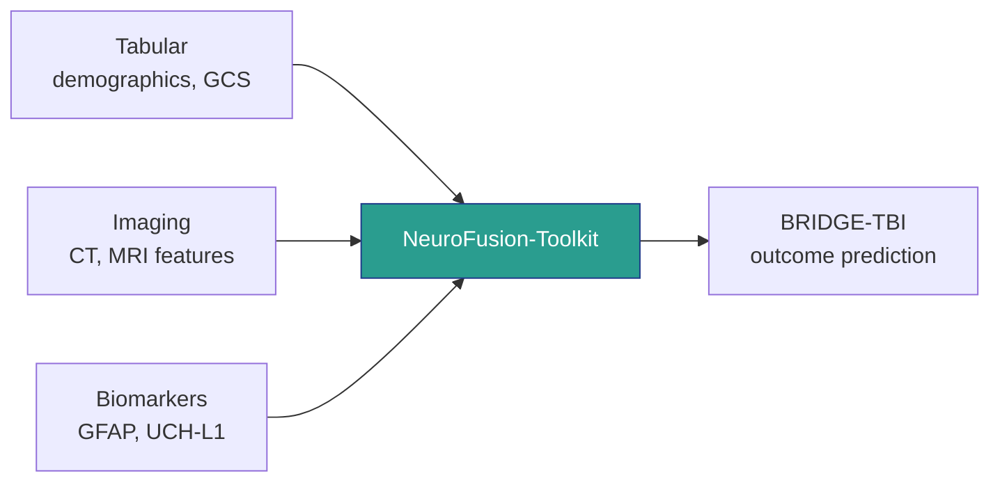

# NeuroFusion-Toolkit -- Multimodal Fusion for Neurological Clinical AI

> *"TBI outcome prediction hits a biological ceiling around AUROC 0.85-0.88 -- reaching it requires principled fusion of tabular, imaging, and biomarker data, not larger models."*

| Attribute | Value |
|-----------|-------|
| Status | Incubating |
| Maturity | Design Phase |
| License | Apache-2.0 |
| Part of | [Evidence Commons](https://github.com/EvidenceOSS) |
| Mission Pillar | Pillar 5 (Multimodal Fusion) |

## Overview

Single-modality models for neurological outcome prediction plateau well below the biological ceiling. Clinical practice produces heterogeneous data -- demographics and GCS scores (tabular), CT and MRI features (imaging), serum biomarkers such as GFAP, UCH-L1, S100B, and NSE (laboratory) -- that arrive at different times, with different missingness patterns, in different formats. NeuroFusion-Toolkit is designed to provide modular fusion architectures that combine these modalities with explicit handling for missing data and temporal misalignment, constrained by clinical ontologies (NINDS CDE v3.0).

Research code for multimodal fusion exists in the parent codebase (`evidenceos-research/evidenceos-multimodal`). This repository is intended to contain extracted, standalone fusion utilities suitable for use outside the EvidenceOS research pipeline. No code has been extracted to this repo yet. Zero production LoRA or quantization code exists in the parent codebase.

## Architecture

| Component | Description | Parent Code Exists |
|-----------|-------------|-------------------|
| `fusion/` | Cross-attention and late fusion architectures | Yes (research-stage) |
| `ordinal/` | CORAL ordinal regression for GOS-E outcome scales | Yes (research-stage) |
| `ontology/` | NINDS CDE-guided ontology constraints for fusion | Partial |
| `missing/` | Missing modality handling and imputation strategies | Planned |
| `vlm/` | Vision-language model integration (MedGemma evaluation path) | Not yet |

## Current State

**What exists in the parent codebase:**
- Multimodal fusion module in `evidenceos-research/evidenceos-multimodal`
- Cross-attention fusion architecture for combining tabular and imaging features
- CORAL ordinal regression implementation for GOS-E prediction
- Ontology-constrained fusion guided by NINDS CDE definitions
- Prior evaluation score: 7/10 (functional but not production-grade)
- MedGemma 1.5 4B identified as base VLM evaluation path

**What does not exist yet:**
- Production LoRA fine-tuning or model quantization code (zero exists)
- Standalone extraction of fusion utilities from the research pipeline
- Missing modality handling as a reusable module
- Temporal alignment utilities for asynchronous clinical data streams
- Benchmarks comparing fusion strategies on TBI outcome prediction

## Extraction Plan

1. Extract core fusion architectures (cross-attention, late fusion) as standalone PyTorch modules
2. Package CORAL ordinal regression as a reusable component for ordered outcome scales (GOS-E, mRS)
3. Define ontology constraint interface compatible with NINDS CDE v3.0 YAML definitions
4. Implement missing modality handling with documented assumptions and failure modes
5. Provide example notebooks demonstrating fusion on synthetic neurological data (no real patient data)

## Ecosystem Context

NeuroFusion-Toolkit is designed to provide the multimodal prediction layer for BRIDGE-TBI (combining tabular and imaging inputs for outcome prediction) and multi-source analysis capabilities for Lab-in-a-Box. Canonical source: [`evidenceos-research/evidenceos-multimodal`](https://github.com/EvidenceOS/evidenceos-research).

## Contributing

This project is in the design phase. Research code exists in the parent codebase but has not been extracted or packaged for standalone use. Contributions to fusion architecture design and missing-modality strategies are the most immediately useful. See [CONTRIBUTING.md](CONTRIBUTING.md).

## License

Apache-2.0 -- see [LICENSE](LICENSE) for details.
